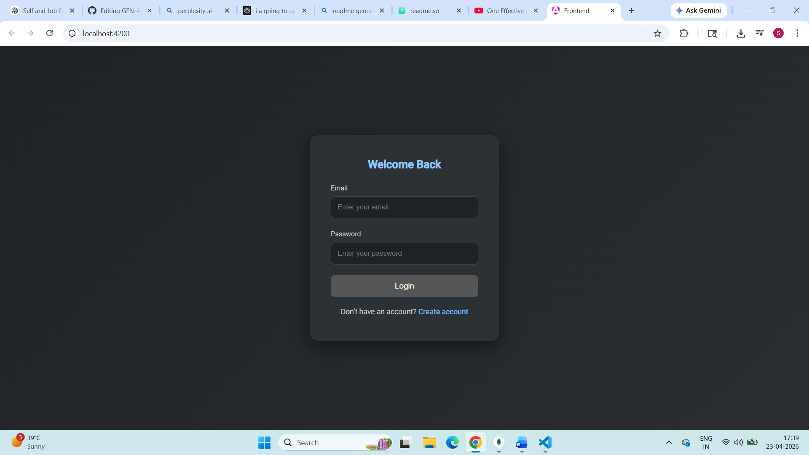
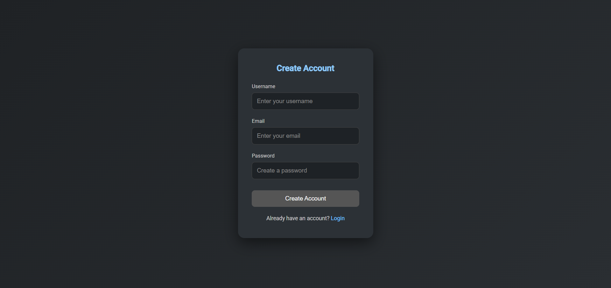
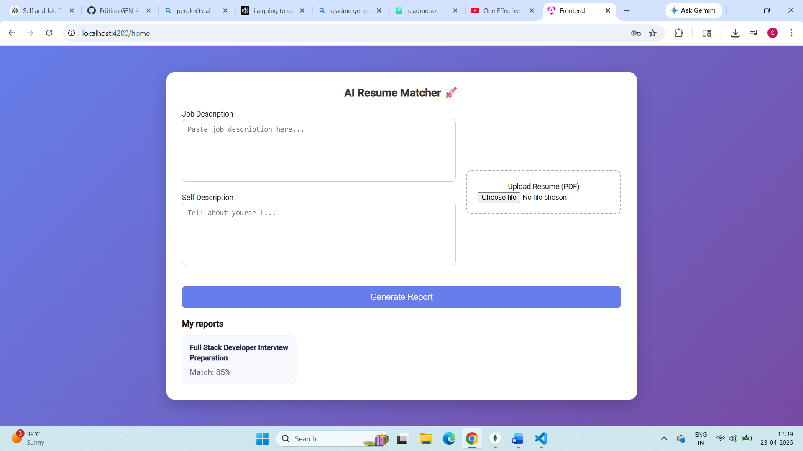
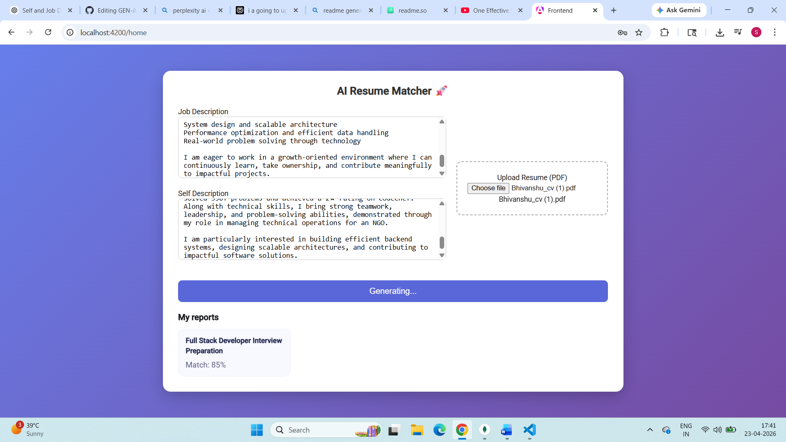
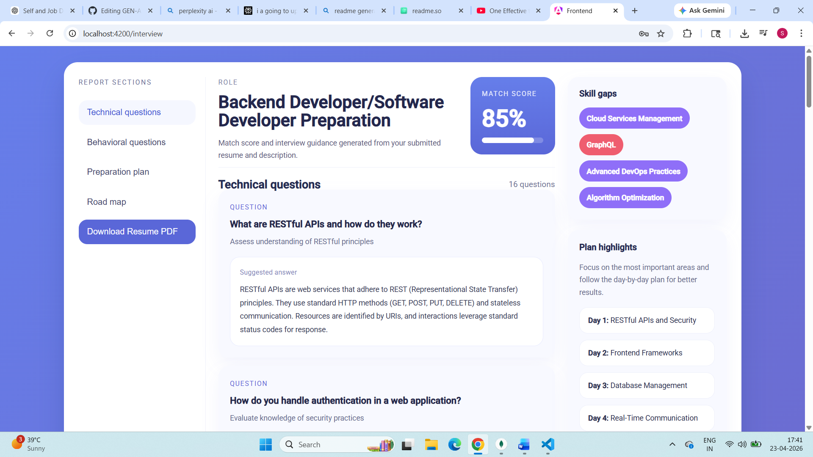
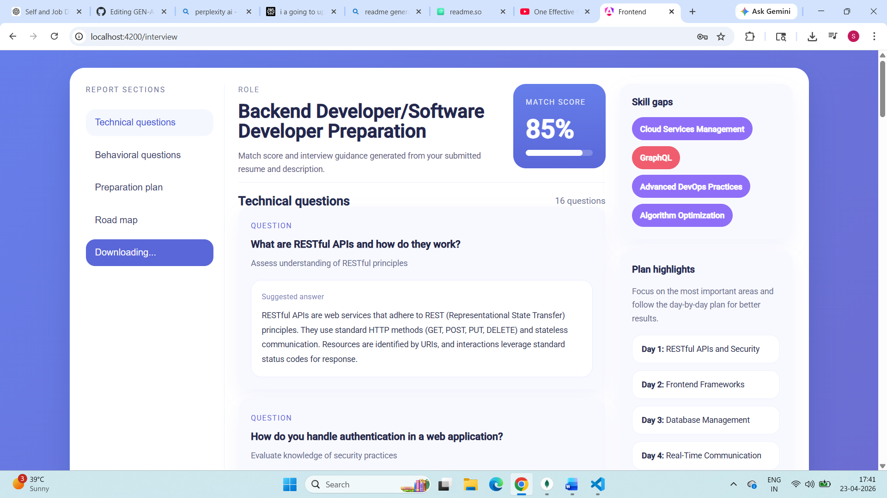
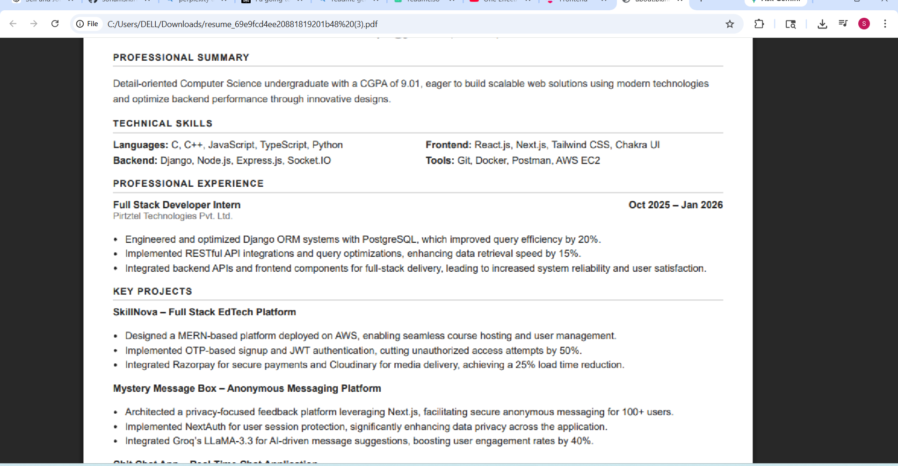

# 🚀 GEN AI Interview Preparation Platform

An AI-powered full-stack web application that helps users prepare for interviews by analyzing resumes and generating structured interview insights.

---

## ✨ Features

* 📄 Upload Resume (PDF supported)
* 🎯 AI-based Match Score with Job Description
* 💡 15–20 Technical Interview Questions (with answers)
* 🧠 10–15 Behavioral Questions
* 📊 Skill Gap Analysis (low / medium / high)
* 📅 Personalized Preparation Plan (day-wise)
* 📥 Download Professional Resume PDF
* 🔐 Authentication (Login/Register with JWT)
* 🗂️ View previous reports

---

## 🛠️ Tech Stack

### Frontend

* Angular
* HTML, CSS, TypeScript

### Backend

* Node.js
* Express.js

### Database

* MongoDB (Mongoose)

### AI & Tools

* OpenRouter API
* Puppeteer (PDF generation)
* pdf-parse (Resume parsing)

---

## ⚙️ Installation

### Clone repo

```bash
git clone https://github.com/sonamsharma8446/GEN-AI-interview-preparation-project.git
```

---

### Backend setup

```bash
cd backend
npm install
```

Create `.env` file:

```bash
OPENROUTER_API_KEY=your_api_key
JWT_SECRET=your_secret
```

Run server:

```bash
npm start
```

---

### Frontend setup

```bash
cd frontend
npm install
ng serve
```

---

## 🚀 How It Works

1. Enter job description
2. Enter self description
3. Upload resume (PDF)
4. Click **Generate Report**

👉 AI generates:

* Match score
* Questions
* Skill gaps
* Preparation plan

👉 You can:

* View reports
* Download resume PDF

---

## 📸 Screenshots

### 🔐 Login Page


### 📝 Register Page


### 🏠 Home Page


### ⚙️ Generating Report (Loading State)


### 📊 Generated Report


### 📥 Downloading Resume


### Resume Pdf


---

## 📂 Project Structure

```
frontend/
backend/
  controllers/
  models/
  services/
```

---

## 🎯 Future Improvements

* 🌐 Deployment (Vercel / AWS)
* 📑 Multiple resume templates
* ⚡ Faster PDF generation
* 📊 Dashboard analytics

---

## 👨‍💻 Author

Sonam Sharma
GitHub: https://github.com/sonamsharma8446
